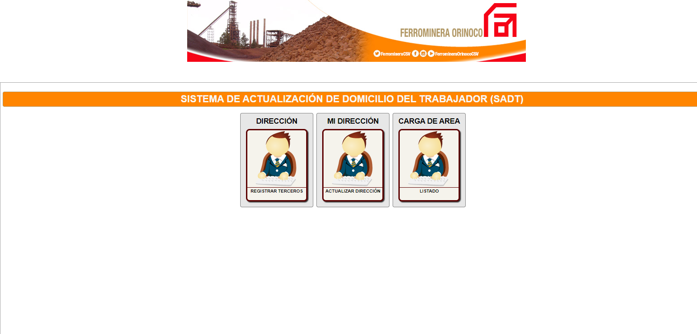
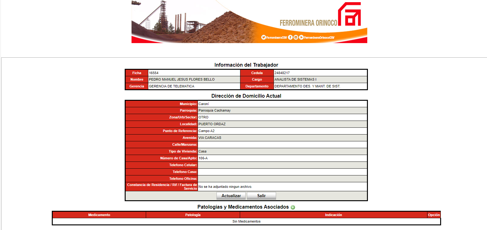

# Project Name

SADT (Sistema de Actualización de Domicilio del Trabajador) / (Worker Address Update System)

## Project Description

System to register and update the worker's adress

## Technologies

- Zend Framework 1.12
- PHP
- HTML
- CSS
- PostgreSQL

## Screenshots

Here are some screenshots of the project:

You can find more screenshots in the "screenshots" folder of this repository.